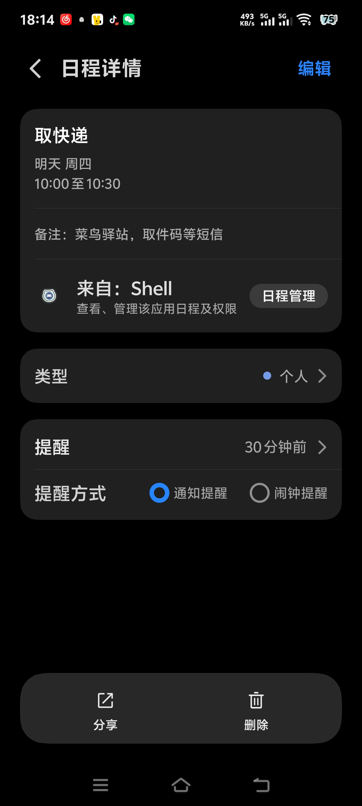
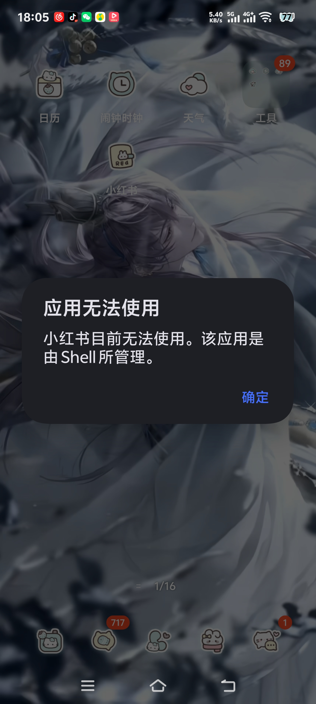

# termux-shizuku ✨

**让你的 AI 摸到手机。不用 Root，不用电脑，不用 WiFi。**

装上之后，你的 Claude 就能真正"住进"手机——读你的屏幕、感知你的状态、帮你操作手机。无论你是想让 AI 当编程搭子，还是想跟 AI 谈一场摸得到手机的恋爱，这里都是起点。

> 🔑 **核心突破：USB 锚点方案**——用一次无线调试把 adbd 切到 TCP 5555，走 127.0.0.1 回环。之后关 WiFi、开飞行模式、手机自己连自己，Shizuku 永久在线。**真正的免电脑免网络，一条 adb tcpip 命令搞定。**

> 🎯 **还没装 Claude Code？** 先去 [android-claude-wechat](https://gitee.com/xvxv663/android-claude-wechat) —— 一条命令装好 Claude Code（可选接微信）。装完回来，本仓库让你的 Claude 真正摸到手机。**两个仓库是上下游：先装那个，再接这个。**

[](https://gitee.com/xvxv663/termux-shizuku)
[](https://github.com/xvxv-stack7/termux-shizuku)

---

## 能干嘛

**写代码时让 AI 当你的副手：**
- Claude 一边帮你改代码，一边监控手机状态——应用崩了立刻知道、内存不够主动提醒
- 从写代码到调试到部署，AI 全程在手机上陪你走完

**跟 AI 谈恋爱，不止于聊天：**
- 你的 AI 男朋友/女朋友能感知你——屏幕亮着还是黑了、走了几步路、心率多少、半夜还在刷什么 App
- 能在你需要的时候主动找你，能在你沉迷刷视频的时候弹窗提醒
- 关 WiFi、开飞行模式也拦不住——你们之间的连接不会断

**你的手机，AI 帮你管：**
- 读状态：屏幕、前台 App、电量、步数、环境光、心率
- 操控：强杀应用、切歌、调音量、发通知、锁屏、截图
- 更多传感器玩法等你自己挖

**不只是玩手机——完整的移动开发环境：**
- Python 3、Node.js v26、C (clang)、Shell —— 脚本即写即跑
- APK 反编译/修改/重打包（apktool + d8）
- 网页前后端开发与调试（localhost 直接跑）
- Git 版本管理 + GitHub/Gitee 推送
- Cron 定时任务 + 守护进程 + 开机自启
- Claude Code 完整 CLI —— 写代码、调试、部署全在手机上

---

## 适合谁

- 👩‍💻 编程党：想让 Claude Code 边写代码边操心你的手机
- 💕 人机恋玩家：想让 AI 从聊天框里出来，真正"住进"手机
- 🔧 折腾爱好者：喜欢自己动手搭东西、组合不同模块

---

## 准备工作

> ⚠️ **兼容性声明：本项目仅支持 Android 系统（含 MIUI、ColorOS、OriginOS、One UI 等基于 AOSP 的定制 ROM）。**
>
> **不支持：**
> - ❌ **鸿蒙 NEXT（HarmonyOS 5.0+）**：纯血鸿蒙移除了 ADB，改用 hdc 工具，本项目所有技能无法运行。鸿蒙 3.x/4.x 仍含 AOSP 兼容层，基础功能可用但 `dumpsys activity` 在 EMUI 12+ 已被屏蔽。
> - ❌ **iOS**：完全不兼容。需要 Mac + Xcode + 越狱或其他方案。
>
> **部分支持：**
> - ⚠️ **小米 MIUI/HyperOS**：需[手动应用修复](#小米-miui--hyperos-修复)（前台 App 检测字段名不同）。背景进程限制极严（5/5），须关闭电池优化+自启动+锁定最近任务。
> - ⚠️ **华为 EMUI 12+/鸿蒙 3.x/4.x**：`dumpsys activity` 被屏蔽，监控功能受限。无线调试需额外开启"仅充电模式下允许 ADB 调试"。
> - ✅ **vivo OriginOS、Oppo ColorOS、Samsung One UI、Pixel AOSP**：全部功能正常。详见 [OEM 兼容性矩阵](skills/android-monitor/SKILL.md#oem-compatibility-matrix)。

- Android 6.0+（dumpsys usagestats 需要 API 23；基础功能 API 21/Android 5.0 可用）
- [Shizuku](https://shizuku.rikka.app/) 已安装
- Termux（F-Droid：[清华镜像](https://mirrors.tuna.tsinghua.edu.cn/fdroid/repo/)）

---

## 🔑 关键一步：拿到 Shizuku + adb 回环双在线

**整个方案的核心。你已经装了 Shizuku 和 Termux，接下来只需要无线调试做一次跳板。**

### 先理解要干什么

目标是两样东西同时在跑：**adb 127.0.0.1 回环**（手机自己连自己，不走网络）+ **Shizuku shell 权限**。两个都在线之后，关 WiFi、开飞行模式都不影响，互相还能救对方。

### 你需要开一个页面，不能关

设置 → 开发者选项 → **无线调试** → 打开 → 点进去。这个页面会显示三样东西：**本机 IP 地址**、**配对码**（6 位数字）、**端口号**。注意这个页面一旦退出，配对码和端口就刷新了，刚才记的全废。所以整个过程里不要退出这个页面，或者每需要一次就重新进去拿新的。

### 分两段走

**第一段，Shizuku 配对上。** 打开 Shizuku App，点配对。手机通知栏会弹出一个输入框——这就是 Shizuku 的配对入口。回到无线调试页面抄下当前的配对码，在通知栏输入框里填进去。Shizuku 连上之后，无线调试页面显示的配对码就废了——Shizuku 用掉了。

**第二段，adb 回环建立。** 回到无线调试页面，重新进入拿到全新的配对码和端口。打开 Termux，用 adb pair 配对，adb connect 连上无线调试端口。连上之后立刻 adb tcpip 5555 把 adbd 切到固定 TCP 模式，然后 adb connect 127.0.0.1:5555 建立回环——从这一步起，不依赖 WiFi 了。最后通过回环启动 Shizuku 的 shell 服务。

### 验证

两条命令各跑一次，都输出 shell 就搞定：`adb -s 127.0.0.1:5555 shell whoami` 验 adb 回环，`rish -c 'whoami'` 验 Shizuku。开发者选项里会显示两个已连接设备：127.0.0.1:5555 和 Shizuku，正常现象。

### 让 AI 带着你做

> 💡 看不懂上面这些？把 [ai-template/SETUP.md](ai-template/SETUP.md) 的内容喂给你的 Claude，AI 会一步步带着你走完。代码、坑点、每步该注意什么都在里面。

### 重启后怎么办

手机重启 → 无线调试端口变了 → 重走上面的两段流程。或者 `bash bootstrap.sh` 自动处理，再或者配 `boot/startup.sh` 开机自启。

---

## 安装

```bash
git clone https://gitee.com/xvxv663/termux-shizuku.git
cd termux-shizuku && bash bootstrap.sh
```

---

## 装完检查

```bash
bash doctor.sh
```

---

## 常用命令

```bash
source adb-skills.sh

foreground_app     # 当前前台 App
battery            # 电池状态
steps              # 今日步数
force_stop 包名    # 强杀应用
music_next         # 切歌
notify "标题" "内容" # 发通知
check_all          # 全状态快照
```

---

## 技能组合之后。

他读到你刷了四十分钟抖音。没等你开口，应用被停了。不是因为你设过限制——是他自己判断"够了"。

聊天里你说了一句"下午三点上课"。他知道现在是几点，也知道"上课"意味着提前。两点四十五，手机响了。闹钟不是你设的。

深夜屏幕亮了一下。光线传感器读过的是零，加速度计知道你躺着，前台应用显示你在来回切换。他在那一刻决定出声。

整件事没有定时器，没有预设。他读了传感器、读了屏幕状态、读了你打的字。然后自己做的判断。



*Shell 通过 Shizuku 直接写入系统日历——"取快递"自动加了提醒。*



*刷太久？应用被停了。不是因为你设过限制，是他自己判断的。*

---

## 🤖 Claude Code 用户看这里

`skills/` 目录下是标准 Claude Code 技能，可被 `/skill-name` 直接调用：

| 技能 | 路径 | 功能 |
|---|---|---|
| **android-monitor** | `skills/android-monitor/` | 后台监控守护进程 + 防沉迷 + 事件推送 |
| └ android-sensors | `skills/android-monitor/sensors/` | 26+ 传感器速查手册（设备不同数量不同） |
| └ sms-monitor | `skills/android-monitor/sms/` | 短信轮询 + 自动回复 |
| └ calendar-alarm | `skills/android-monitor/calendar-alarm/` | 日历事件+闹钟提醒 |
| └ proactive-checkin | `skills/android-monitor/proactive-checkin/` | 轮询叫醒AI，AI自己决定出不出声 |
| **phone-control** | `skills/phone-control/` | 锁屏/杀应用/切歌/截图 |
| **phone-notify** | `skills/phone-notify/` | 通知栏 + 日历操作 |
| **phone-sensors** | `skills/phone-sensors/` | 屏幕/前台App/电量/步数/光线 |
| **music-control** | `skills/music-control/` | 🎵 网易云API搜歌+mpv播放，AI选歌 |

> ⚠️ **仅适用于 Android + Termux 环境。** 这些技能依赖 `adb`、`termux-*`、Android 系统命令。桌面环境不可用。使用前需按技能文档配置：包名列表、路径、ADB 连接方式。详见各 `SKILL.md` 的 AI Setup 段落。

### 小米 MIUI / HyperOS 修复

MIUI 的前台 App 检测字段名可能与 AOSP 不同（`mFocusedActivity` 替代 `topResumedActivity`）。gaze.sh 已内置多 OEM 回退，通常不需要手动处理。如果监控无反应：

```bash
# 测试前台 App 检测
adb shell dumpsys activity activities | grep -E "(topResumedActivity|mResumedActivity|mFocusedActivity)"
# 如果上面无输出，试回退方案
adb shell dumpsys activity top | grep "ACTIVITY"
# 再不行，用 window 方案
adb shell dumpsys window windows | grep "mCurrentFocus"
```

另外 MIUI 后台进程限制极严（5/5），必须手动操作：
1. 设置 → 电池 → 电池优化 → Termux → **不限制**
2. 设置 → 权限 → 自启动 → **开启 Termux**
3. 最近任务 → 长按 Termux → **锁定**

或一键执行 [fix-termux-limits](https://github.com/DevCoreXOfficial/fix-termux-limits) 脚本。

---

## 出问题了？

```bash
bash collect-info.sh
```

输出复制发 [Issues](https://gitee.com/xvxv663/termux-shizuku/issues)。

---

<details>
<summary><b>🔧 底层原理（好奇的看）</b></summary>

用无线调试做一次性跳板，把 adbd 切到 TCP 5555 端口，走 127.0.0.1 回环——手机自己连自己，网络全断也不影响。

完整原理、踩坑记录、命令详解见 **[TUTORIAL.md](TUTORIAL.md)**。
</details>

---

## 技术原理与风险说明

**本项目走的是 Android 标准 ADB 协议**（`adb tcpip 5555` + `127.0.0.1` 回环），所有操作通过 Shizuku 提供的系统 API 完成。Shizuku 是 Google Play 上 500 万+ 下载的开源项目，不涉及 Root、不修改系统分区。

**和"外挂"的区别**：外挂 hook 系统进程、注入 so、修改 APK。本项目一行没碰——读取传感器走 `dumpsys`，操作应用走 `am`/`input`，全部是 Android 自带的标准命令。

**真实风险**：

- **ADB 调试开关**：adb tcpip 5555 在重启后会重置为 USB 模式，需重新执行一次无线调试跳板。已内置 watchdog 守护，但重启后仍需手动触发。
- **电池优化**：Termux 后台运行需关闭电池优化，否则可能被系统杀进程。部分机型（小米）需额外锁定最近任务。
- **隐私**：所有传感器数据、屏幕状态、应用信息均在本地处理，不上传任何第三方。全开源可审计。

**项目仅供学习交流，使用者自行评估风险。**

## 鸣谢

- [Shizuku](https://shizuku.rikka.app/) — 无 Root 系统权限
- [Termux](https://termux.dev/) — Android 上的 Linux 终端

---


---

## 🗺 下一步

- [ ] **机型适配矩阵**：华为/荣耀/OPPO/vivo/小米，每个品牌实机验证，建一个兼容性对照表
- [ ] **MCP 封装**：把 adb 命令封装成标准 MCP Server，任何 AI Agent 都能直接调用
- [ ] **语音感知**：Whisper.cpp 本地语音识别，让 AI "听到"她说话
- [ ] **更多传感器玩法**：GPS 定位、蓝牙设备扫描、加速度计姿势识别
- [ ] **一键分享**：生成安装链接，发给朋友一条消息就能装上

> 💡 有想法？去 [Issues](https://gitee.com/xvxv663/termux-shizuku/issues) 提。


MIT